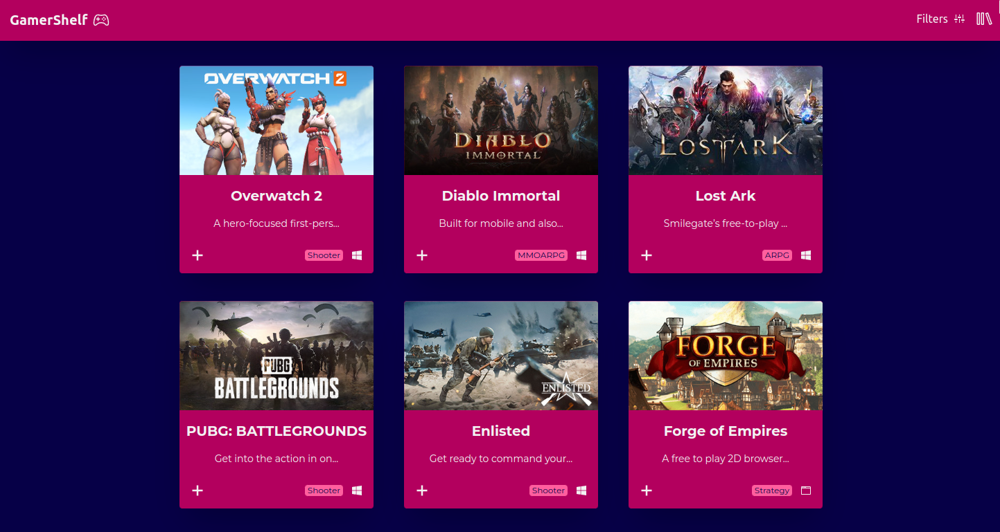

# 🎮 GamerShelf

<p align="center">
  <a href="#-description">Description</a>&nbsp;&nbsp;&nbsp;|&nbsp;&nbsp;&nbsp;
  <a href="#-deploy">Deploy</a>&nbsp;&nbsp;&nbsp;|&nbsp;&nbsp;&nbsp;
  <a href="#-tech-stack">Tech Stack</a>&nbsp;&nbsp;&nbsp;|&nbsp;&nbsp;&nbsp;
  <a href="#-environment-variables">Environment Variables</a>&nbsp;&nbsp;&nbsp;|&nbsp;&nbsp;&nbsp;
  <a href="#-install-&-scripts">Install & Scripts</a>&nbsp;&nbsp;&nbsp;|&nbsp;&nbsp;&nbsp;
  <a href="#-contribution">contribution</a>&nbsp;&nbsp;&nbsp;|&nbsp;&nbsp;&nbsp;
  <a href="#-license">License</a>&nbsp;&nbsp;&nbsp;|&nbsp;&nbsp;&nbsp;
</p>

<br>

<p align="center">
  
</p>


## 📙 Description

GamerShelf is a web application that allows gamers to keep track of their game collection in one convenient place. Upon visiting the website, users can add games to their virtual shelves. The app also allows users to filter games and add them to their collection with ease.

Each game in the collection has its own page with information such as the title, release date, platform, genre, and a description.

This web app utilizes the [free-to-play API](https://www.freetogame.com/api-doc).


## 💻 Deploy

- [Click here](https://gamer-shelf.vercel.app/) to go to a Vercel deploy of this app
## ⚙️ Functionality

- View a specific game details
- Add and remove games from library
- Filter games based on a set of chosen of parameters

## 🛠 Tech Stack

- Vite
    - React
        - Redux & Redux Toolkit
        - React Router
        - React Icons
        - React Toastify
    - TypeScript
- Tailwind
    - Classnames
- ESLint + Prettier
    - Airbnb JavaScript Style Guidelines
- Dotenv
    - Path resolving / alias


## 🔢 Environment Variables

This web app needs three Environment Variables:

```bash
    VITE_RAPID_API_KEY
    VITE_RAPID_API_HOST
    VITE_GAMES_API_BASE_URL
```

All three variables are type string and provided by [Rapid API](https://rapidapi.com/)

## 👨‍💻 Install & Scripts

Download and setup the environment variables in a ```.env``` file in your root folder

Install dependecies on NPM:
```bash
  npm install
```

Run local server:
```bash
  npm run dev
```
Format files with Airbnb JavaScript Style Guidelines:
```bash
  npm run format
```

Create build for deploying:
```bash
  npm run build
```

## 👥 Contribution

If you'd like to contribute with this project, simply open up a Pull Request.


## 🔑 License

[MIT](https://choosealicense.com/licenses/mit/)

